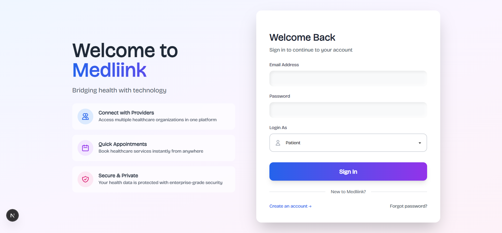

# Medliink: Healthcare Connection Platform

> A modern healthcare connection platform that bridges the gap between patients and clinical organizations.

## Quick Start

### Prerequisites
- Node.js 18+ or Bun runtime
- MongoDB (local or MongoDB Atlas)
- Git

### Installation

1. **Clone the repository**
```bash
git clone https://github.com/yankee-svg/medliink.git
cd medliink
```

2. **Install dependencies**
```bash
bun install
cd backend/medliink-api
npm install
cd ../..
```

3. **Set up environment variables**

Create `.env.local` in the root directory:
```env
NEXT_PUBLIC_BASE_URL=http://localhost:5000/api
NEXT_PUBLIC_SOCKET_URL=http://localhost:5000
ANTHROPIC_API_KEY=your_anthropic_key
NEXT_PUBLIC_LIVEKIT_URL=your_livekit_url
LIVEKIT_API_KEY=your_livekit_key
LIVEKIT_API_SECRET=your_livekit_secret
```

Create `.env` in `backend/medliink-api/`:
```env
PORT=5000
MONGODB_URI=your_mongodb_uri
JWT_ACCESS_SECRET=your_secret
JWT_REFRESH_SECRET=your_secret
EMAIL_USER=your_email
EMAIL_PASSWORD=your_password
OPENAI_API_KEY=your_openai_key
LIVEKIT_API_KEY=your_livekit_key
LIVEKIT_API_SECRET=your_livekit_secret
LIVEKIT_URL=your_livekit_url
FRONTEND_URL=http://localhost:3000
```

4. **Run the application**
```bash
npm run dev:all
```

The app will be available at:
- Frontend: http://localhost:3000
- Backend: http://localhost:5000

## Test Accounts

### Patient Account
- **Username**: chuk@gmail.org
- **Password**: 123456

### Healthcare Provider Account
- **Username**: emerybarame60@gmail.com
- **Password**: 321123

## Screenshots



### Dashboard


### Appointments


### Hospitals Profile


### Messages


### User Profile settings


## Documentation

**SRC Document**: [View Project Documentation](https://docs.google.com/document/d/1wrWeo49uevmkeFqwhYxFAg4Dci9W9UUwEZH1Z5St8hY/edit?usp=sharing)

**Demo Video**: [Watch Demo on YouTube](https://youtu.be/zQ-todfG51w)