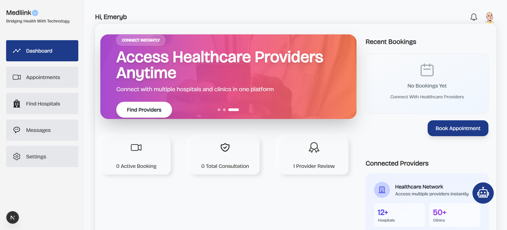
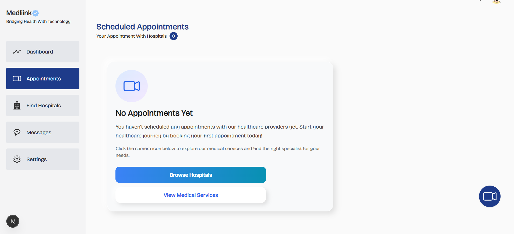
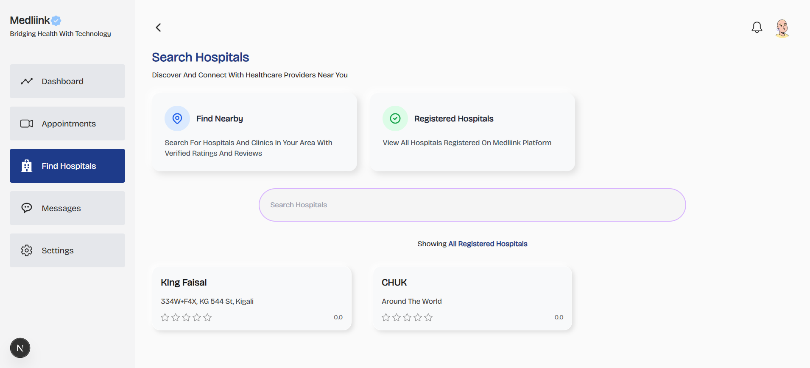
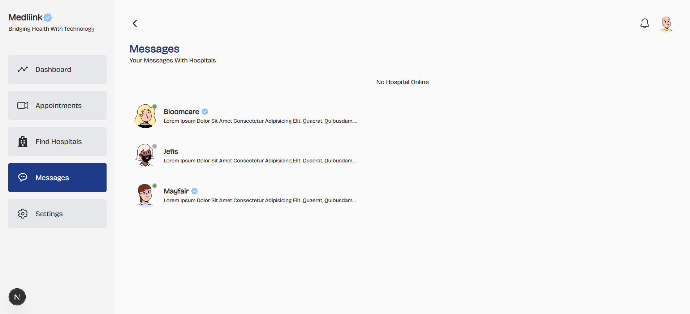
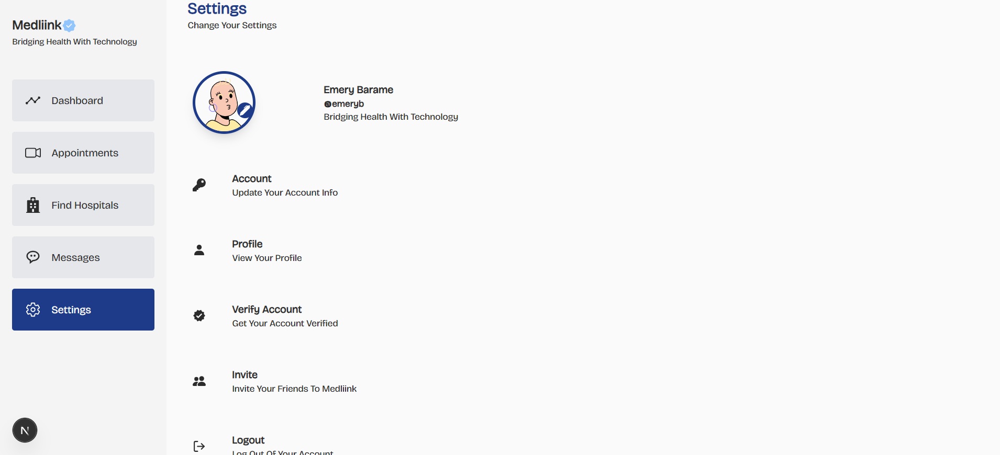
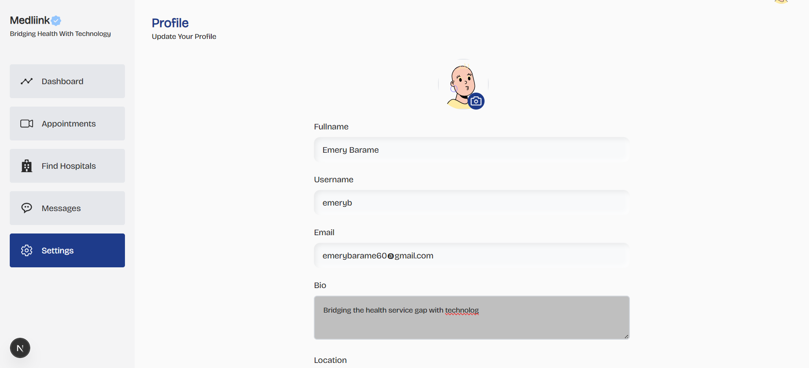

# Medliink: Healthcare managment system

test user: emerybarame60@gmail.com
pass: 321123

## how to run 

1 .git clone
2.  run 'bun install'
3. bun run dev

Medliink is a [prototype](vercel.app.lomk) healthcare management plaform. its a full stack web app designed to modernize the intersection of healthcare delivery and digital technology. By providing comprehensive solutions for both healthcare providers and patients, Medliink addresses critical inefficiencies in healthcare administration, appointment management, and patient engagement. The platform leverages cutting-edge web technologies and artificial intelligence to create a seamless, user-centric healthcare ecosystem that improves accessibility, operational efficiency, and quality of care.

## Problem Statement

The contemporary healthcare landscape faces several systemic challenges:

- **Fragmented Communication**: Disconnect between patients and healthcare providers leads to inefficient care coordination and poor patient outcomes
- **Administrative Burden**: Healthcare institutions struggle with manual processes for appointment scheduling, patient management, and data administration
- **Limited Accessibility**: Patients face barriers in accessing their health information and scheduling appointments with healthcare providers
- **Information Asymmetry**: Lack of immediate access to healthcare information and personalized medical guidance
- **Operational Inefficiency**: Healthcare providers lack integrated digital tools to streamline their workflows and optimize resource allocation

These challenges necessitate a comprehensive digital solution that bridges the gap between patients and healthcare institutions while enhancing operational efficiency and care quality.

## Solution Overview

Medliink addresses these challenges through a dual-dashboard architecture that serves two primary stakeholder groups:

### Patient-Facing Features
- Personalized health information management dashboard
- Integrated appointment booking and scheduling system
- Real-time connection with healthcare providers
- AI-powered health assistant for personalized medical guidance
- Comprehensive health records access and management

### Hospital-Facing Features
- Centralized patient management system
- Streamlined appointment scheduling and calendar management
- Administrative workflow optimization tools
- Data analytics and reporting capabilities
- Integration-ready architecture for hospital management systems

## Technical Architecture

### Frontend Technology Stack
- **Framework**: React and Next.js for optimal performance and SEO capabilities
- **State Management**: Redux and Redux Toolkit for predictable state containers
- **Data Fetching**: Redux Toolkit Query (RTK Query) for efficient API data management
- **User Interface**: Modern, responsive design optimized for accessibility

### Backend Infrastructure
- **Runtime Environment**: Node.js for scalable server-side operations
- **API Framework**: Express.js for robust RESTful API development
- **HTTP Client**: Axios for reliable client-server communication
- **Data Management**: Integrated state synchronization between client and server

### A.I Integration
- **Health Assistant**: GPT-based conversational AI model providing:
  - Personalized healthcare information
  - Medical guidance and education
  - Symptom assessment support
  - Health-related query resolution

## Impl~ Challenges and Solutions

### Technical Challenges

**Challenge 1: RTK Query Integration**
- *Issue*: Complex configuration requirements for RTK Query within Next.js environment
- *Solution*: Developed custom configuration patterns and middleware to seamlessly integrate RTK Query with Next.js server-side rendering capabilities

**Challenge 2: Real-Time State Management**
- *Issue*: Managing real-time healthcare data while maintaining application performance
- *Solution*: Implemented optimized Redux patterns with normalized state structure and selective re-rendering strategies

**Challenge 3: Learning Curve**
- *Issue*: First-time implementation of Redux Toolkit in a large-scale production environment
- *Solution*: Adopted iterative development approach with continuous learning and code refactoring

## Key Achievements

1. **Advanced State Management**: Successfully implemented enterprise-grade state management using Redux and Redux Toolkit for the first time in a production environment

2. **AI Integration**: Pioneered the integration of GPT-based health assistant technology, representing the team's inaugural venture into AI-powered healthcare solutions

3. **Scalable Architecture**: Designed and deployed a full-stack application capable of supporting concurrent users across multiple healthcare institutions

4. **Modern Development Practices**: Adopted industry-standard development workflows including component-based architecture and API-first design

## Technical Competencies Acquired

Through the development of Medliink, the team gained expertise in:

- Advanced Redux patterns and Redux Toolkit Query implementation
- Next.js server-side rendering and static site generation
- Large-scale React application architecture
- RESTful API design and implementation
- AI/ML model integration in production environments
- Healthcare data management and privacy considerations

## Future Roadmap

### Phase 1: Monetization Strategy
- Implement subscription-based revenue model for healthcare providers
- Develop tiered service packages for different hospital sizes
- Create payment processing infrastructure

### Phase 2: Staff Management Module
- Build comprehensive staff directory and profile management
- Implement staff-to-appointment assignment system
- Develop staff scheduling and availability tracking
- Enable patient-provider matching based on specializations

### Phase 3: Enterprise Integration
- Develop Hospital Management System (HMS) integration capabilities
- Create unified platform consolidating all healthcare operations
- Build API gateway for third-party system integrations
- Implement advanced analytics and reporting dashboards

### Phase 4: Enhanced Features
- Telemedicine capabilities for remote consultations
- Electronic prescription management
- Laboratory and diagnostic test integration
- Patient feedback and satisfaction tracking
- Compliance and regulatory reporting tools

## Conclusion

Medliink represents a significant advancement in healthcare technology, demonstrating the potential of modern web technologies and artificial intelligence to transform healthcare delivery. By addressing critical pain points in patient-provider communication and healthcare administration, Medliink positions itself as a comprehensive solution for the digital transformation of healthcare institutions. The platform's modular architecture and planned feature expansions ensure its continued relevance and value in an evolving healthcare landscape.

## Technical Documentation

For implementation details, API documentation, and integration guides, please refer to the project wiki and developer documentation.

## Sreenshots

### Dashboard

### Appointments

### Search Hospitals

### Hospital Profile

### Messages

### Message Hospital

### Message Hospital

### User Profile

### Specific Appointment

### Submit Hospital Review

### View All Reviews Made

### Hospital Mini Profile

---

**Keywords**: Healthcare Technology, Digital Health, Patient Management, Hospital Administration, Redux, Next.js, Node.js, AI Healthcare Assistant, Healthcare SaaS
